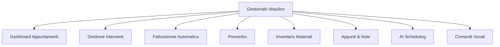
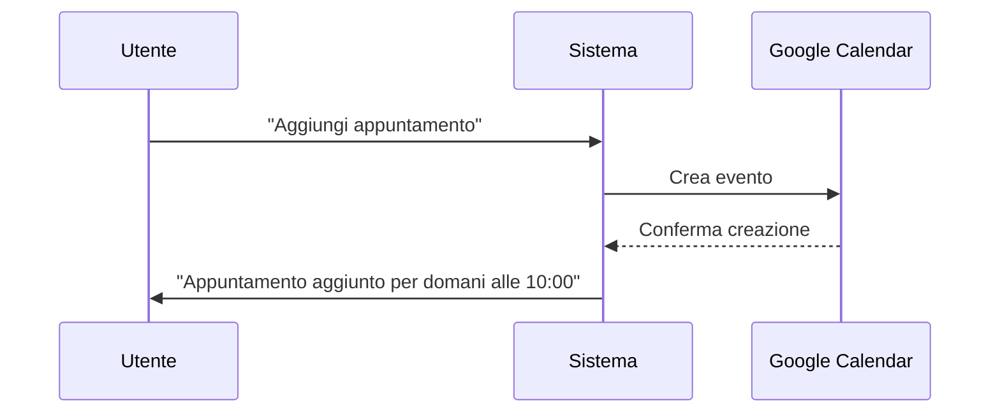
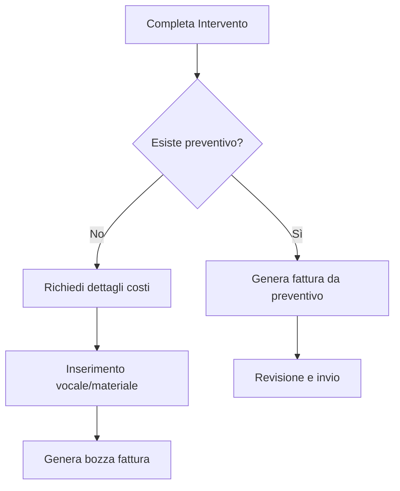

# Gestionale per Idraulico - Web App

Ecco la struttura completa di una web app personalizzata per ottimizzare il tuo lavoro come idraulico, integrata con intelligenza artificiale e funzionalità vocali.

## Funzionalità Principali

### 1. **Dashboard Appuntamenti**
- **Visualizzazione giornaliera/settimanale** degli appuntamenti
- Integrazione automatica con **Google Calendar**
- Notifiche push per appuntamenti imminenti
- Indicatori visivi per:
  - 🟢 Appuntamenti confermati
  - 🟡 Da confermare
  - 🔴 Urgenti
- Mappa interattiva con percorso ottimizzato tra gli appuntamenti

### 2. **Comandi Vocali Integrati**

- Comandi supportati:
  - "Aggiungi appuntamento [dettagli]"
  - "Completa intervento [indirizzo]"
  - "Crea preventivo per [cliente]"
  - "Aggiungi [materiale] all'inventario"
  - "Genera fattura per [indirizzo]"

### 3. **AI Scheduling Assistante**
- Ottimizzazione automatica degli appuntamenti basata su:
  - Localizzazione geografica
  - Traffico in tempo reale
  - Durata stimata degli interventi
  - Priorità cliente
- Suggerimenti intelligenti per:
  - Raggruppare appuntamenti vicini
  - Evitare conflitti di orario
  - Gestire tempi morti

### 4. **Gestione Interventi**
- Scheda intervento con:
  - Dettaglio cliente (storico, preferenze)
  - Foto/documenti correlati
  - Checklist intervento predefinita
  - Materiali previsti/effettivi
- Pulsante "Completa Intervento" che avvia:
  1. Registrazione tempo lavorato
  2. Aggiornamento inventario
  3. Avvio processo di fatturazione

### 5. **Fatturazione Automatica**

- Funzionalità:
  - Creazione automatica da preventivo
  - Template personalizzabili
  - Calcolo automatico IVA e totali
  - Invio diretto via email al cliente
  - Archiviazione cloud delle fatture

### 6. **Gestione Preventivi**
- Database preventivi ricercabile per:
  - Cliente
  - Tipologia lavoro
  - Località
  - Data
- Funzionalità speciali:
  - "Clona preventivo" per lavori simili
  - Conversione preventivo → fattura in 1 click
  - Firme digitali per accettazione preventivo

### 7. **Inventario Materiali**
- Registro materiali in magazzino/macchina:
  - Quantità disponibile
  - Posizione (magazzino/van)
  - Prezzi di acquisto/vendita
- Funzioni avanzate:
  - Alert riordino automatici
  - Consumo automatico dagli interventi
  - Cronologia movimenti
  - QR code per scansione rapida

### 8. **Sezione Appunti & Note**
- Blocco note vocale/testuale
- Organizzazione per:
  - Cliente
  - Intervento
  - Data
- Funzioni speciali:
  - Trascrizione automatica note vocali
  - Ricerca full-text
  - Tag e categorizzazione

### 9. **Reportistica & Analisi**
- Dashboard performance:
  - Interventi mensili/anno
  - Fatturato per tipologia lavoro
  - Clienti più redditizi
  - Materiali più utilizzati
- Esportazione dati in Excel/PDF

## Architettura Tecnologica

| Componente | Tecnologia | Descrizione |
|------------|------------|-------------|
| **Frontend** | React.js | Interfaccia reattiva mobile-first |
| **Backend** | Node.js + Express | Gestione logica applicativa |
| **Database** | Firebase Firestore | Database NoSQL in tempo reale |
| **AI Engine** | Dialogflow + Google Cloud AI | Elaborazione linguaggio naturale |
| **Calendar Sync** | Google Calendar API | Sincronizzazione bidirezionale |
| **Voice Processing** | Web Speech API | Riconoscimento vocale browser |
| **Mappe** | Google Maps Platform | Geocalizzazione e routing |
| **Hosting** | Google Cloud Platform | Scalabilità e sicurezza |

## Flusso di Lavoro Giornaliero

1. **Mattina**: 
   - Apri app → Dashboard con appuntamenti giornalieri
   - Controllo percorso ottimizzato su mappa
   - Revisione materiali necessari per gli interventi

2. **Durante gli interventi**:
   - Aggiornamento stato intervento in tempo reale
   - Registrazione materiali utilizzati
   - Appunti vocali per dettagli lavoro

3. **Fine intervento**:
   - Flag "Completa" → Avvio fatturazione automatica
   - Aggiornamento inventario automatico

4. **Sera**:
   - Revisione fatture generate
   - Programmazione appuntamenti con AI assistant
   - Controllo alert materiali da riordinare

## Sicurezza e Privacy
- Crittografia end-to-end dei dati
- Autenticazione a due fattori
- Backup giornalieri automatici
- Conformità GDPR per dati clienti

Questa struttura combina automazione, intelligenza artificiale e comandi vocali per ottimizzare ogni aspetto del tuo lavoro, riducendo il tempo amministrativo e aumentando l'efficienza operativa.
